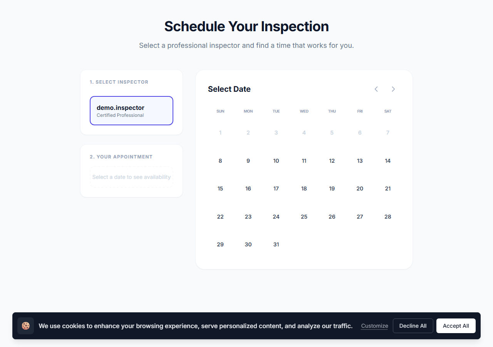
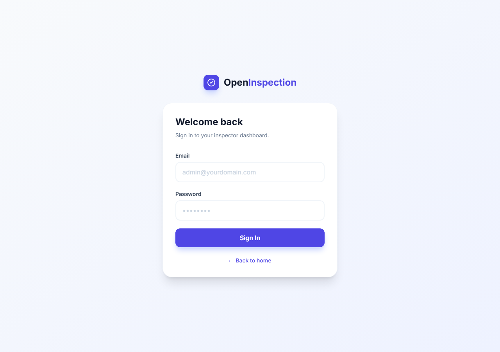
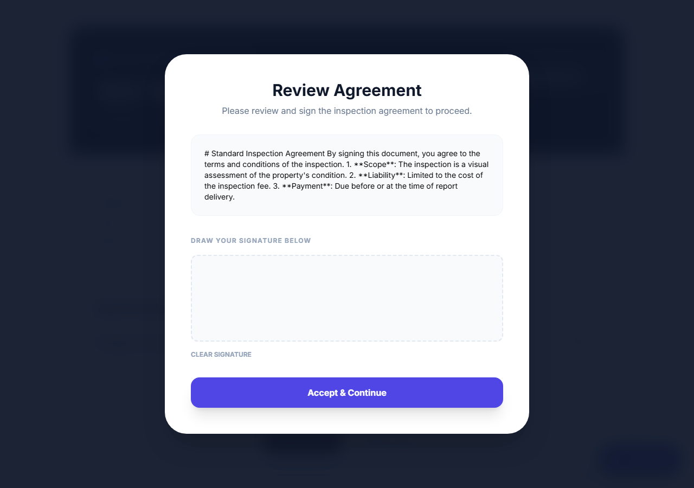

# UI Screenshots — apps/core

### Home Page (`/`)

### Public Booking Page (`/book`)
Cloudflare Turnstile widget injected when `TURNSTILE_SITE_KEY` is configured.

### Login Page (`/login`)
Sets `httpOnly` `inspector_token` cookie on success. Protected pages redirect here when cookie is absent or invalid.

### First-Run Setup Wizard (`/setup`)
Auto-shown on first deployment when DB is empty. Returns 409 if already complete.

### Demo Inspection Report (`/api/inspections/demo/report`)
E-signature step + pay-to-unlock Stripe checkout. Full content blurred until paid.

